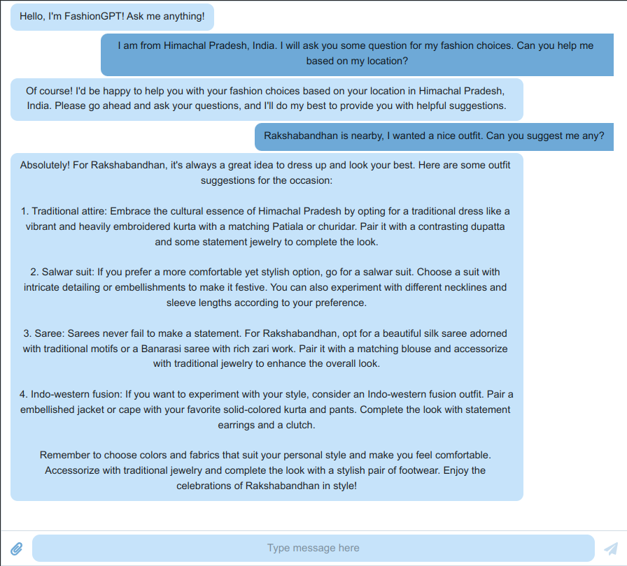

## Fashion-GPT 👕👖

Website Link - https://kaleidoscopic-puppy-10f194.netlify.app

A Chatbot which can help users to find clothes they want to buy using natural language.

Write a message to the bot and it will suggest clothes which you can buy.

This tool processes your query, offering relevant suggestions according to your location. Using geolocation API, it gets latitude and longitude which is sent to Google Maps API via which it determines your state and country, adding this information to the query for better results.

The bot is very intelligent and has the ability to have normal conversatations. It can also understand the context of the conversation and respond accordingly. It can also understand the user's mood and respond accordingly. I takes account of the user's previous messages and responds accordingly also takes fashion preferences into account. It also understand occassions and festivals and suggests outfits accordingly.

Future scope: We can grab relevant keywords from the response and use it to get the recommended outfits from the database. We can also use the user's location to get the weather and suggest clothes accordingly. We can also use the user's response to get the user's preferences and suggest clothes accordingly.

### How to run

1. Clone the repository
2. Install the requirements using `npm i`
3. Run the development server using `npm run dev`
4. Open `localhost:5173` in your browser
5. Start chatting with the bot